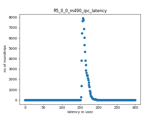
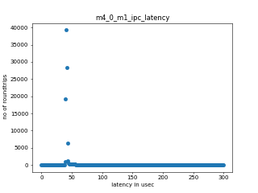
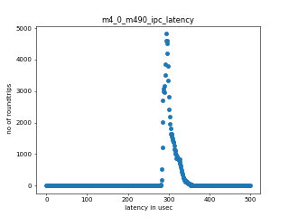

======================================
RT-linux 11.02.08.02 Performance Guide
======================================

.. rubric::  **Read This First**
   :name: read-this-first-rt-kernel-perf-guide

**All performance numbers provided in this document are gathered using
following Evaluation Modules unless otherwise specified.**

+----------------+---------------------------------------------------------------------------------------------------------------------+
| Name           | Description                                                                                                         |
+================+=====================================================================================================================+
| AM64x EVM      | AM64x Evaluation Module rev E1 with ARM running at 1GHz, DDR data rate 1600 MT/S                                    |
+----------------+---------------------------------------------------------------------------------------------------------------------+

Table:  Evaluation Modules

.. rubric::  About This Manual
   :name: about-this-manual-rt-kernel-perf-guide

This document provides performance data for each of the device drivers
which are part of the Processor SDK Linux package. This document should be
used in conjunction with release notes and user guides provided with the
Processor SDK Linux package for information on specific issues present
with drivers included in a particular release.

.. rubric::  If You Need Assistance
   :name: if-you-need-assistance-rt-kernel-perf-guide

For further information or to report any problems, contact
https://e2e.ti.com/ or https://support.ti.com/

|

System Benchmarks
-----------------

LMBench
^^^^^^^
LMBench is a collection of microbenchmarks of which the memory bandwidth 
and latency related ones are typically used to estimate processor 
memory system performance. More information about lmbench at 
https://lmbench.sourceforge.net/whatis_lmbench.html and
https://lmbench.sourceforge.net/man/lmbench.8.html
  
**Latency**: lat_mem_rd-stride128-szN, where N is equal to or smaller than the cache
size at given level measures the cache miss penalty. N that is at least
double the size of last level cache is the latency to external memory.

**Bandwidth**: bw_mem_bcopy-N, where N is equal to or smaller than the cache size at
a given level measures the achievable memory bandwidth from software doing
a memcpy() type operation. Typical use is for external memory bandwidth
calculation. The bandwidth is calculated as byte read and written counts
as 1 which should be roughly half of STREAM copy result.

Execute the LMBench with the following:

::

    cd /opt/ltp
    ./runltp -P j721e-idk-gw -f ddt/lmbench -s LMBENCH_L_PERF_0001

.. csv-table:: LMBench Benchmarks
    :header: "Benchmarks","am64xx-hsevm: perf"

    "af_unix_sock_stream_latency (microsec)","42.81 (min 37.94, max 47.17)"
    "af_unix_socket_stream_bandwidth (mb\s)","541.45 (min 530.54, max 556.53)"
    "bw_file_rd-io-1mb (mb/s)","875.51 (min 850.20, max 890.31)"
    "bw_file_rd-o2c-1mb (mb/s)","491.77 (min 456.00, max 508.82)"
    "bw_mem-bcopy-16mb (mb/s)","969.07 (min 937.70, max 1007.87)"
    "bw_mem-bcopy-1mb (mb/s)","947.26 (min 915.75, max 980.01)"
    "bw_mem-bcopy-2mb (mb/s)","934.26 (min 902.53, max 970.87)"
    "bw_mem-bcopy-4mb (mb/s)","949.68 (min 911.68, max 983.28)"
    "bw_mem-bcopy-8mb (mb/s)","976.43 (min 911.99, max 1010.61)"
    "bw_mem-bzero-16mb (mb/s)","2117.38 (min 2116.68, max 2118.08)"
    "bw_mem-bzero-1mb (mb/s)","1532.87 (min 915.75, max 2119.87)"
    "bw_mem-bzero-2mb (mb/s)","1524.64 (min 902.53, max 2117.90)"
    "bw_mem-bzero-4mb (mb/s)","1532.55 (min 911.68, max 2118.64)"
    "bw_mem-bzero-8mb (mb/s)","1546.42 (min 911.99, max 2118.36)"
    "bw_mem-cp-16mb (mb/s)","592.63 (min 576.54, max 600.85)"
    "bw_mem-cp-1mb (mb/s)","1585.65 (min 543.97, max 2718.45)"
    "bw_mem-cp-2mb (mb/s)","1432.40 (min 524.11, max 2363.14)"
    "bw_mem-cp-4mb (mb/s)","1376.53 (min 523.49, max 2214.43)"
    "bw_mem-cp-8mb (mb/s)","1352.70 (min 523.01, max 2157.79)"
    "bw_mem-fcp-16mb (mb/s)","1051.58 (min 1000.13, max 1099.43)"
    "bw_mem-fcp-1mb (mb/s)","1591.05 (min 1028.10, max 2119.87)"
    "bw_mem-fcp-2mb (mb/s)","1567.15 (min 987.33, max 2117.90)"
    "bw_mem-fcp-4mb (mb/s)","1565.96 (min 982.08, max 2118.64)"
    "bw_mem-fcp-8mb (mb/s)","1571.64 (min 971.46, max 2118.36)"
    "bw_mem-frd-16mb (mb/s)","1317.14 (min 1282.36, max 1364.84)"
    "bw_mem-frd-1mb (mb/s)","1170.35 (min 1028.10, max 1305.24)"
    "bw_mem-frd-2mb (mb/s)","1167.91 (min 987.33, max 1373.86)"
    "bw_mem-frd-4mb (mb/s)","1161.96 (min 982.08, max 1330.23)"
    "bw_mem-frd-8mb (mb/s)","1175.62 (min 971.46, max 1385.76)"
    "bw_mem-fwr-16mb (mb/s)","2122.36 (min 2106.37, max 2131.91)"
    "bw_mem-fwr-1mb (mb/s)","1933.56 (min 1216.12, max 2718.45)"
    "bw_mem-fwr-2mb (mb/s)","1822.22 (min 1261.83, max 2363.14)"
    "bw_mem-fwr-4mb (mb/s)","1754.10 (min 1265.82, max 2214.43)"
    "bw_mem-fwr-8mb (mb/s)","1736.68 (min 1236.09, max 2157.79)"
    "bw_mem-rd-16mb (mb/s)","1366.15 (min 1338.24, max 1382.65)"
    "bw_mem-rd-1mb (mb/s)","1100.78 (min 793.27, max 1403.09)"
    "bw_mem-rd-2mb (mb/s)","1101.55 (min 801.18, max 1400.81)"
    "bw_mem-rd-4mb (mb/s)","1105.82 (min 824.91, max 1399.09)"
    "bw_mem-rd-8mb (mb/s)","1125.63 (min 861.05, max 1393.73)"
    "bw_mem-rdwr-16mb (mb/s)","856.58 (min 844.73, max 870.65)"
    "bw_mem-rdwr-1mb (mb/s)","693.30 (min 543.97, max 838.64)"
    "bw_mem-rdwr-2mb (mb/s)","671.55 (min 524.11, max 834.84)"
    "bw_mem-rdwr-4mb (mb/s)","684.01 (min 523.49, max 844.77)"
    "bw_mem-rdwr-8mb (mb/s)","701.39 (min 523.01, max 857.08)"
    "bw_mem-wr-16mb (mb/s)","893.90 (min 886.48, max 899.79)"
    "bw_mem-wr-1mb (mb/s)","819.90 (min 754.86, max 847.17)"
    "bw_mem-wr-2mb (mb/s)","814.11 (min 777.91, max 836.35)"
    "bw_mem-wr-4mb (mb/s)","828.96 (min 793.41, max 876.33)"
    "bw_mem-wr-8mb (mb/s)","864.35 (min 836.65, max 897.06)"
    "bw_mmap_rd-mo-1mb (mb/s)","1320.67 (min 1272.50, max 1351.35)"
    "bw_mmap_rd-o2c-1mb (mb/s)","474.18 (min 454.27, max 483.64)"
    "bw_pipe (mb/s)","540.02 (min 518.86, max 558.01)"
    "bw_unix (mb/s)","541.45 (min 530.54, max 556.53)"
    "lat_connect (us)","75.76 (min 74.84, max 78.74)"
    "lat_ctx-2-128k (us)","10.34 (min 8.76, max 11.41)"
    "lat_ctx-2-256k (us)","22.65 (min 15.21, max 28.60)"
    "lat_ctx-4-128k (us)","11.46 (min 10.21, max 12.85)"
    "lat_ctx-4-256k (us)","10.78 (min 0.00, max 18.44)"
    "lat_fs-0k (num_files)","198.38 (min 194.00, max 203.00)"
    "lat_fs-10k (num_files)","88.38 (min 82.00, max 103.00)"
    "lat_fs-1k (num_files)","132.88 (min 129.00, max 138.00)"
    "lat_fs-4k (num_files)","118.50 (min 107.00, max 126.00)"
    "lat_mem_rd-stride128-sz1000k (ns)","47.38 (min 46.80, max 48.23)"
    "lat_mem_rd-stride128-sz125k (ns)","7.85 (min 7.80, max 7.97)"
    "lat_mem_rd-stride128-sz250k (ns)","12.09 (min 10.07, max 14.63)"
    "lat_mem_rd-stride128-sz31k (ns)","5.25 (min 3.07, max 5.90)"
    "lat_mem_rd-stride128-sz50 (ns)","3.02"
    "lat_mem_rd-stride128-sz500k (ns)","43.10 (min 41.58, max 44.38)"
    "lat_mem_rd-stride128-sz62k (ns)","7.15 (min 6.43, max 7.42)"
    "lat_mmap-1m (us)","69.00 (min 65.00, max 76.00)"
    "lat_ops-double-add (ns)","4.02"
    "lat_ops-double-div (ns)","22.13 (min 22.12, max 22.14)"
    "lat_ops-double-mul (ns)","4.02 (min 4.02, max 4.03)"
    "lat_ops-float-add (ns)","4.02"
    "lat_ops-float-div (ns)","13.07"
    "lat_ops-float-mul (ns)","4.02"
    "lat_ops-int-add (ns)","1.01"
    "lat_ops-int-bit (ns)","0.67"
    "lat_ops-int-div (ns)","6.03 (min 6.03, max 6.04)"
    "lat_ops-int-mod (ns)","6.37 (min 6.37, max 6.39)"
    "lat_ops-int-mul (ns)","4.34 (min 4.32, max 4.42)"
    "lat_ops-int64-add (ns)","1.01"
    "lat_ops-int64-bit (ns)","0.67"
    "lat_ops-int64-div (ns)","9.56 (min 9.55, max 9.57)"
    "lat_ops-int64-mod (ns)","7.38 (min 7.37, max 7.39)"
    "lat_ops-int64-mul (ns)","5.01 (min 4.99, max 5.13)"
    "lat_pagefault (us)","1.81 (min 1.76, max 1.84)"
    "lat_pipe (us)","26.34 (min 25.73, max 27.06)"
    "lat_proc-exec (us)","1176.48 (min 1144.00, max 1221.00)"
    "lat_proc-fork (us)","1019.08 (min 1002.83, max 1054.80)"
    "lat_proc-proccall (us)","0.01"
    "lat_select (us)","46.72 (min 46.13, max 47.43)"
    "lat_sem (us)","3.45 (min 3.16, max 3.71)"
    "lat_sig-catch (us)","5.78 (min 5.65, max 5.93)"
    "lat_sig-install (us)","0.94 (min 0.93, max 1.00)"
    "lat_sig-prot (us)","0.75 (min 0.69, max 0.81)"
    "lat_syscall-fstat (us)","2.55 (min 2.49, max 2.67)"
    "lat_syscall-null (us)","0.62 (min 0.60, max 0.68)"
    "lat_syscall-open (us)","386.20 (min 345.40, max 419.63)"
    "lat_syscall-read (us)","0.83 (min 0.82, max 0.88)"
    "lat_syscall-stat (us)","6.88 (min 6.48, max 7.35)"
    "lat_syscall-write (us)","0.79 (min 0.77, max 0.83)"
    "lat_tcp (us)","1.12 (min 1.10, max 1.16)"
    "lat_unix (us)","42.81 (min 37.94, max 47.17)"
    "latency_for_0.50_mb_block_size (nanosec)","43.10 (min 41.58, max 44.38)"
    "latency_for_1.00_mb_block_size (nanosec)","23.69 (min 0.00, max 48.23)"
    "pipe_bandwidth (mb\s)","540.02 (min 518.86, max 558.01)"
    "pipe_latency (microsec)","26.34 (min 25.73, max 27.06)"
    "procedure_call (microsec)","0.01"
    "select_on_200_tcp_fds (microsec)","46.72 (min 46.13, max 47.43)"
    "semaphore_latency (microsec)","3.45 (min 3.16, max 3.71)"
    "signal_handler_latency (microsec)","0.94 (min 0.93, max 1.00)"
    "signal_handler_overhead (microsec)","5.78 (min 5.65, max 5.93)"
    "tcp_ip_connection_cost_to_localhost (microsec)","75.76 (min 74.84, max 78.74)"
    "tcp_latency_using_localhost (microsec)","1.12 (min 1.10, max 1.16)"

Dhrystone
^^^^^^^^^
Dhrystone is a core only benchmark that runs from warm L1 caches in all
modern processors. It scales linearly with clock speed. For standard ARM
cores the DMIPS/MHz score will be identical with the same compiler and flags.

.. csv-table:: Dhrystone Benchmarks
    :header: "Benchmarks","am64xx-hsevm: perf"

    "cpu_clock (mhz)","1000.00"
    "dhrystone_per_mhz (dmips/mhz)","2.90"
    "dhrystone_per_second (dhrystonep)","5128205.00"

Whetstone
^^^^^^^^^

.. csv-table:: Whetstone Benchmarks
    :header: "Benchmarks","am64xx-hsevm: perf"

    "whetstone (mips)","4583.33 (min 3333.30, max 5000.00)"

Linpack
^^^^^^^
Linpack measures peak double precision (64 bit) floating point performance in
solving a dense linear system.

.. csv-table:: Linpack Benchmarks
    :header: "Benchmarks","am64xx-hsevm: perf"

    "linpack (kflops)","407927.00 (min 406745.00, max 408901.00)"

CoreMarkPro
^^^^^^^^^^^
CoreMark®-Pro is a comprehensive, advanced processor benchmark that works with
and enhances the market-proven industry-standard EEMBC CoreMark® benchmark.
While CoreMark stresses the CPU pipeline, CoreMark-Pro tests the entire processor,
adding comprehensive support for multicore technology, a combination of integer
and floating-point workloads, and data sets for utilizing larger memory subsystems.

.. csv-table:: CoreMarkPro Benchmarks
    :header: "Benchmarks","am64xx-hsevm: perf"

    "cjpeg-rose7-preset (workloads/)","29.58 (min 29.41, max 29.67)"
    "core (workloads/)","0.21"
    "coremark-pro ()","588.47 (min 585.75, max 593.10)"
    "linear_alg-mid-100x100-sp (workloads/)","10.41 (min 10.41, max 10.42)"
    "loops-all-mid-10k-sp (workloads/)","0.48"
    "nnet_test (workloads/)","0.77 (min 0.76, max 0.77)"
    "parser-125k (workloads/)","5.46 (min 5.21, max 5.62)"
    "radix2-big-64k (workloads/)","20.60 (min 19.46, max 21.53)"
    "sha-test (workloads/)","57.72 (min 57.47, max 57.80)"
    "zip-test (workloads/)","15.47 (min 15.38, max 15.63)"

.. csv-table:: CoreMarkProTwoCore Benchmarks
    :header: "Benchmarks","am64xx-hsevm: perf"

    "cjpeg-rose7-preset (workloads/)","55.33 (min 38.46, max 59.17)"
    "core (workloads/)","0.43 (min 0.42, max 0.43)"
    "coremark-pro ()","1041.66 (min 1003.86, max 1052.62)"
    "linear_alg-mid-100x100-sp (workloads/)","20.81 (min 20.78, max 20.84)"
    "loops-all-mid-10k-sp (workloads/)","0.88 (min 0.87, max 0.89)"
    "nnet_test (workloads/)","1.54"
    "parser-125k (workloads/)","5.86 (min 5.56, max 6.15)"
    "radix2-big-64k (workloads/)","32.59 (min 31.39, max 33.66)"
    "sha-test (workloads/)","115.13 (min 114.94, max 116.28)"
    "zip-test (workloads/)","28.17 (min 27.78, max 28.57)"

MultiBench
^^^^^^^^^^
MultiBench™ is a suite of benchmarks that allows processor and system designers to
analyze, test, and improve multicore processors. It uses three forms of concurrency:
Data decomposition: multiple threads cooperating on achieving a unified goal and
demonstrating a processor’s support for fine grain parallelism.
Processing multiple data streams: uses common code running over multiple threads and
demonstrating how well a processor scales over scalable data inputs.
Multiple workload processing: shows the scalability of general-purpose processing,
demonstrating concurrency over both code and data.
MultiBench combines a wide variety of application-specific workloads with the EEMBC
Multi-Instance-Test Harness (MITH), compatible and portable with most any multicore
processors and operating systems. MITH uses a thread-based API (POSIX-compliant) to
establish a common programming model that communicates with the benchmark through an
abstraction layer and provides a flexible interface to allow a wide variety of
thread-enabled workloads to be tested.

.. csv-table:: Multibench Benchmarks
    :header: "Benchmarks","am64xx-hsevm: perf"

    "4m-check (workloads/)","282.33 (min 280.68, max 284.84)"
    "4m-check-reassembly (workloads/)","61.37 (min 61.12, max 61.50)"
    "4m-check-reassembly-tcp (workloads/)","36.64 (min 36.39, max 36.93)"
    "4m-check-reassembly-tcp-cmykw2-rotatew2 (workloads/)","14.60 (min 14.57, max 14.63)"
    "4m-check-reassembly-tcp-x264w2 (workloads/)","0.75 (min 0.74, max 0.75)"
    "4m-cmykw2 (workloads/)","85.93 (min 85.80, max 86.17)"
    "4m-cmykw2-rotatew2 (workloads/)","17.54 (min 16.62, max 18.35)"
    "4m-reassembly (workloads/)","56.76 (min 56.34, max 57.24)"
    "4m-rotatew2 (workloads/)","20.14 (min 18.86, max 21.70)"
    "4m-tcp-mixed (workloads/)","84.66 (min 83.77, max 85.56)"
    "4m-x264w2 (workloads/)","0.77 (min 0.76, max 0.77)"
    "empty-wld (workloads/)","1.00"
    "idct-4m (workloads/)","13.67 (min 13.65, max 13.68)"
    "idct-4mw1 (workloads/)","13.67 (min 13.65, max 13.68)"
    "ippktcheck-4m (workloads/)","282.00 (min 280.96, max 284.51)"
    "ippktcheck-4mw1 (workloads/)","282.27 (min 281.37, max 284.61)"
    "ipres-4m (workloads/)","72.04 (min 71.70, max 72.39)"
    "ipres-4mw1 (workloads/)","72.29 (min 72.05, max 72.50)"
    "md5-4m (workloads/)","19.98 (min 19.88, max 20.02)"
    "md5-4mw1 (workloads/)","20.01 (min 19.94, max 20.06)"
    "rgbcmyk-4m (workloads/)","44.75 (min 44.72, max 44.77)"
    "rgbcmyk-4mw1 (workloads/)","44.72 (min 44.69, max 44.77)"
    "rotate-4ms1 (workloads/)","16.62 (min 16.49, max 16.78)"
    "rotate-4ms1w1 (workloads/)","16.57 (min 16.30, max 16.74)"
    "rotate-4ms64 (workloads/)","16.83 (min 16.77, max 16.95)"
    "rotate-4ms64w1 (workloads/)","16.82 (min 16.77, max 16.92)"
    "x264-4mq (workloads/)","0.41"
    "x264-4mqw1 (workloads/)","0.41"

Boot-time Measurement
---------------------

Boot media: MMCSD
^^^^^^^^^^^^^^^^^

.. csv-table:: Linux boot time MMCSD
    :header: "Boot Configuration","am64xx-hsevm: Boot time in seconds: avg(min,max)"

    "Linux boot time from SD with default rootfs (20 boot cycles)","22.36 (min 20.60, max 27.42)"

Boot time numbers [avg, min, max] are measured from "Starting kernel" to Linux prompt across 20 boot cycles.

|

OSPI Flash Driver
-----------------

.. rubric:: AM64XX-EVM
   :name: am64xx-evm-ospi

.. rubric:: RAW
   :name: am64xx-evm-ospi-raw

.. csv-table:: OSPI Raw Flash Driver
    :header: "File size (Mbytes)","am64xx-hsevm: Raw Read Throughput (Mbytes/sec)"

    "50","139.89 (min 113.64, max 147.06)"

EMMC Driver
-----------
.. warning::

  **IMPORTANT**: The performance numbers can be severely affected if the media is
  mounted in sync mode. Hot plug scripts in the filesystem mount
  removable media in sync mode to ensure data integrity. For performance
  sensitive applications, umount the auto-mounted filesystem and
  re-mount in async mode.

EMMC EXT4 FIO 1G
^^^^^^^^^^^^^^^^

.. csv-table:: EMMC EXT4 FIO 1G
    :header: "Buffer size (bytes)","am64xx-hsevm: Write EXT4 Throughput (Mbytes/sec)","am64xx-hsevm: Write EXT4 CPU Load (%)","am64xx-hsevm: Read EXT4 Throughput (Mbytes/sec)","am64xx-hsevm: Read EXT4 CPU Load (%)"

    "1m","60.75 (min 59.60, max 61.40)","4.00 (min 3.73, max 4.22)","175.00","7.20 (min 6.77, max 7.82)"
    "4m","60.83 (min 59.80, max 61.70)","2.88 (min 2.78, max 2.95)","174.75 (min 174.00, max 175.00)","5.76 (min 5.30, max 6.12)"
    "4k","49.86 (min 49.10, max 50.40)","52.21 (min 51.71, max 52.53)","56.18 (min 56.00, max 56.40)","47.11 (min 46.00, max 49.21)"
    "256k","60.75 (min 59.70, max 61.50)","5.94 (min 5.65, max 6.25)","174.00","8.90 (min 8.58, max 9.48)"

EMMC EXT4
"""""""""

.. csv-table:: EMMC EXT4
    :header: "Buffer size (bytes)","am64xx-hsevm: Write EXT4 Throughput (Mbytes/sec)","am64xx-hsevm: Write EXT4 CPU Load (%)","am64xx-hsevm: Read EXT4 Throughput (Mbytes/sec)","am64xx-hsevm: Read EXT4 CPU Load (%)"

    "102400","53.87 (min 49.65, max 55.64)","11.09 (min 9.38, max 15.25)","176.52 (min 171.28, max 177.31)","29.36 (min 28.30, max 29.63)"
    "262144","53.52 (min 49.20, max 55.06)","11.06 (min 9.50, max 15.22)","181.79 (min 181.43, max 182.11)","30.36 (min 29.36, max 31.53)"
    "524288","53.64 (min 49.72, max 55.58)","10.94 (min 9.33, max 14.88)","182.88 (min 182.70, max 183.02)","27.74 (min 26.13, max 29.20)"
    "1048576","53.83 (min 49.26, max 55.68)","10.72 (min 9.28, max 14.60)","182.91 (min 182.86, max 183.00)","26.93 (min 25.45, max 28.57)"
    "5242880","53.93 (min 49.61, max 56.34)","10.61 (min 9.26, max 14.60)","182.80 (min 182.62, max 182.95)","27.64 (min 26.61, max 28.57)"

EMMC VFAT
"""""""""

.. csv-table:: EMMC VFAT
    :header: "Buffer size (bytes)","am64xx-hsevm: Write VFAT Throughput (Mbytes/sec)","am64xx-hsevm: Write VFAT CPU Load (%)","am64xx-hsevm: Read VFAT Throughput (Mbytes/sec)","am64xx-hsevm: Read VFAT CPU Load (%)"

    "102400","49.34 (min 40.10, max 53.27)","13.58 (min 11.41, max 20.45)","166.32 (min 164.99, max 167.10)","30.88 (min 29.20, max 31.90)"
    "262144","50.55 (min 41.76, max 53.49)","13.71 (min 11.72, max 20.37)","168.61 (min 161.34, max 171.00)","35.58 (min 29.57, max 50.82)"
    "524288","50.67 (min 41.94, max 53.88)","14.01 (min 11.56, max 20.24)","169.98 (min 169.68, max 170.20)","27.60 (min 27.50, max 28.10)"
    "1048576","50.86 (min 41.78, max 54.00)","13.53 (min 11.59, max 20.00)","169.78 (min 169.62, max 169.88)","27.34 (min 26.05, max 28.10)"
    "5242880","50.75 (min 41.22, max 54.11)","13.44 (min 11.66, max 19.75)","170.06 (min 169.90, max 170.19)","27.70 (min 27.27, max 28.33)"

UBoot EMMC Driver
-----------------

.. csv-table:: UBOOT EMMC RAW
    :header: "File size (bytes in hex)","am64xx-hsevm: Write Throughput (Kbytes/sec)","am64xx-hsevm: Read Throughput (Kbytes/sec)"

    "2000000","59674.24 (min 56594.13, max 61134.33)","168800.07 (min 168041.03, max 169782.38)"
    "4000000","60491.03 (min 57387.04, max 61768.14)","172690.99 (min 172463.16, max 173375.66)"

MMCSD
-----

.. warning::

  **IMPORTANT**: The performance numbers can be severely affected if the media is
  mounted in sync mode. Hot plug scripts in the filesystem mount
  removable media in sync mode to ensure data integrity. For performance
  sensitive applications, umount the auto-mounted filesystem and
  re-mount in async mode.

MMC EXT4 FIO 1G
^^^^^^^^^^^^^^^

.. csv-table:: MMC EXT4 FIO 1G
    :header: "Buffer size (bytes)","am64xx-hsevm: Write EXT4 Throughput (Mbytes/sec)","am64xx-hsevm: Write EXT4 CPU Load (%)","am64xx-hsevm: Read EXT4 Throughput (Mbytes/sec)","am64xx-hsevm: Read EXT4 CPU Load (%)"

    "1m","42.00 (min 41.40, max 42.50)","3.43 (min 3.33, max 3.67)","86.94 (min 86.70, max 87.30)","5.02 (min 4.81, max 5.29)"
    "4m","41.90 (min 41.20, max 42.70)","2.59 (min 2.51, max 2.67)","86.33 (min 82.30, max 87.10)","3.73 (min 3.38, max 3.99)"
    "4k","2.76 (min 2.70, max 2.87)","7.29 (min 7.00, max 8.06)","12.76 (min 12.70, max 12.80)","14.14 (min 13.37, max 14.99)"
    "256k","37.41 (min 36.60, max 38.70)","4.53 (min 4.26, max 4.84)","83.15 (min 82.80, max 83.80)","6.69 (min 6.42, max 7.06)"

MMC EXT4
^^^^^^^^

.. csv-table:: MMC EXT4
    :header: "Buffer size (bytes)","am64xx-hsevm: Write Raw Throughput (Mbytes/sec)","am64xx-hsevm: Write Raw CPU Load (%)","am64xx-hsevm: Read Raw Throughput (Mbytes/sec)","am64xx-hsevm: Read Raw CPU Load (%)"

    "102400","29.65 (min 27.48, max 32.92)","6.38 (min 5.22, max 9.52)","38.94 (min 37.34, max 41.04)","7.41 (min 7.07, max 7.77)"
    "262144","28.96 (min 27.17, max 31.59)","6.52 (min 5.28, max 9.31)","40.55 (min 39.38, max 41.90)","6.57 (min 6.20, max 7.11)"
    "524288","29.58 (min 27.10, max 32.84)","6.12 (min 4.95, max 9.82)","45.12 (min 42.60, max 45.56)","6.75 (min 6.36, max 6.99)"
    "1048576","29.85 (min 28.58, max 32.27)","6.13 (min 4.97, max 9.06)","45.39 (min 45.16, max 45.52)","6.71 (min 6.36, max 7.17)"
    "5242880","29.78 (min 28.51, max 33.57)","5.85 (min 4.81, max 8.70)","45.22 (min 44.88, max 45.51)","6.85 (min 6.51, max 7.33)"

The performance numbers were captured using the following:

-  SanDisk Max Endurance SD card (SDSQQVR-032G-GN6IA)
-  Partition was mounted with async option

|

CRYPTO Driver
-------------

OpenSSL Performance
^^^^^^^^^^^^^^^^^^^

.. csv-table:: OpenSSL Performance
    :header: "Algorithm","Buffer Size (in bytes)","am64xx-hsevm: throughput (KBytes/Sec)"

    "aes-128-cbc","1024","21201.11 (min 19586.05, max 21629.27)"
    "aes-128-cbc","16","305.74 (min 295.07, max 317.97)"
    "aes-128-cbc","16384","137300.65 (min 134600.02, max 139203.93)"
    "aes-128-cbc","256","5427.83 (min 5317.12, max 5639.77)"
    "aes-128-cbc","64","1333.09 (min 1290.43, max 1389.82)"
    "aes-128-cbc","8192","98276.35 (min 96264.19, max 99693.91)"
    "aes-128-ecb","1024","21623.04 (min 20551.00, max 22215.00)"
    "aes-128-ecb","16","312.77 (min 297.66, max 329.37)"
    "aes-128-ecb","16384","141950.29 (min 140525.57, max 143638.53)"
    "aes-128-ecb","256","5490.12 (min 5154.73, max 5683.37)"
    "aes-128-ecb","64","1360.48 (min 1284.46, max 1411.31)"
    "aes-128-ecb","8192","101527.21 (min 99691.18, max 102948.86)"
    "aes-192-cbc","1024","21028.78 (min 19525.97, max 21523.11)"
    "aes-192-cbc","16","311.25 (min 294.13, max 320.98)"
    "aes-192-cbc","16384","128866.99 (min 127462.06, max 130378.41)"
    "aes-192-cbc","256","5524.78 (min 5259.43, max 5622.10)"
    "aes-192-cbc","64","1364.05 (min 1286.27, max 1390.40)"
    "aes-192-cbc","8192","94148.27 (min 92752.55, max 95668.91)"
    "aes-192-ecb","1024","21608.83 (min 20942.51, max 22065.83)"
    "aes-192-ecb","16","314.19 (min 301.85, max 325.51)"
    "aes-192-ecb","16384","132728.15 (min 132104.19, max 133327.53)"
    "aes-192-ecb","256","5513.00 (min 5258.24, max 5673.05)"
    "aes-192-ecb","64","1369.78 (min 1305.26, max 1411.67)"
    "aes-192-ecb","8192","97255.42 (min 96520.87, max 98402.30)"
    "aes-256-cbc","1024","21003.86 (min 18761.39, max 21494.78)"
    "aes-256-cbc","16","314.16 (min 297.62, max 322.65)"
    "aes-256-cbc","16384","121110.53 (min 120105.64, max 122344.79)"
    "aes-256-cbc","256","5537.48 (min 5443.41, max 5665.71)"
    "aes-256-cbc","64","1377.82 (min 1358.29, max 1398.68)"
    "aes-256-cbc","8192","90706.26 (min 89451.18, max 91501.91)"
    "aes-256-ecb","1024","21289.98 (min 20055.38, max 21793.11)"
    "aes-256-ecb","16","308.54 (min 300.03, max 320.75)"
    "aes-256-ecb","16384","125571.07 (min 124474.71, max 127385.60)"
    "aes-256-ecb","256","5471.54 (min 5277.53, max 5680.98)"
    "aes-256-ecb","64","1351.16 (min 1297.41, max 1409.83)"
    "aes-256-ecb","8192","93359.79 (min 92383.91, max 94601.22)"
    "sha256","1024","28245.16 (min 27951.45, max 28524.20)"
    "sha256","16","471.00 (min 466.66, max 475.25)"
    "sha256","16384","218273.11 (min 216738.47, max 220250.11)"
    "sha256","256","7394.91 (min 7313.49, max 7465.56)"
    "sha256","64","1871.55 (min 1853.21, max 1889.11)"
    "sha256","8192","149173.25 (min 148398.08, max 149848.06)"
    "sha512","1024","18903.94 (min 18712.58, max 19061.76)"
    "sha512","16","449.39 (min 444.90, max 451.80)"
    "sha512","16384","48433.15 (min 48059.73, max 48562.18)"
    "sha512","256","6372.07 (min 6279.94, max 6436.78)"
    "sha512","64","1803.87 (min 1779.22, max 1823.55)"
    "sha512","8192","43742.21 (min 43578.71, max 43835.39)"

.. csv-table:: OpenSSL CPU Load
    :header: "Algorithm","am64xx-hsevm: CPU Load"

    "aes-128-cbc","43.25 (min 42.00, max 44.00)"
    "aes-128-ecb","45.13 (min 43.00, max 46.00)"
    "aes-192-cbc","43.75 (min 43.00, max 45.00)"
    "aes-192-ecb","44.63 (min 44.00, max 45.00)"
    "aes-256-cbc","43.63 (min 43.00, max 44.00)"
    "aes-256-ecb","43.88 (min 43.00, max 45.00)"
    "sha256","93.00"
    "sha512","92.50 (min 90.00, max 93.00)"

Listed for each algorithm are the code snippets used to run each benchmark test.

::

    time -v openssl speed -elapsed -evp aes-128-cbc

|

RP Message Inter-Processor Communication (IPC) Latency
-------------------------------------------------------

RP Message latency Performance
^^^^^^^^^^^^^^^^^^^^^^^^^^^^^^

RP Message latency is the delay measured from sending a round trip echo message from
a Linux application to a remote processor and back. The following measurements use
a RP message length of 1 byte and 490 bytes for comparison.

The Linux user space application `rpmsg_char_benchmark <https://git.ti.com/cgit/rpmsg/ti-rpmsg-char/>`__ captures these latency values.

Test commands used for running IPC latency tests:

.. code:: console

   rpmsg_char_benchmark -r 2 -n 100000 -m 1 & chrt -f -p 80 $!

Latencies reported:

.. csv-table::
   :header: "Remote Processor","Message Size (in bytes)","Average round trip (usecs)","Max round trip (usecs)"

   "R5F0_0","1","34","165"
   "R5F0_0","490","155","279"
   "M4F","1","45","138"
   "M4F","490","285","408"

.. image:: img/R5_0_0_m1_ipc_latency.png

